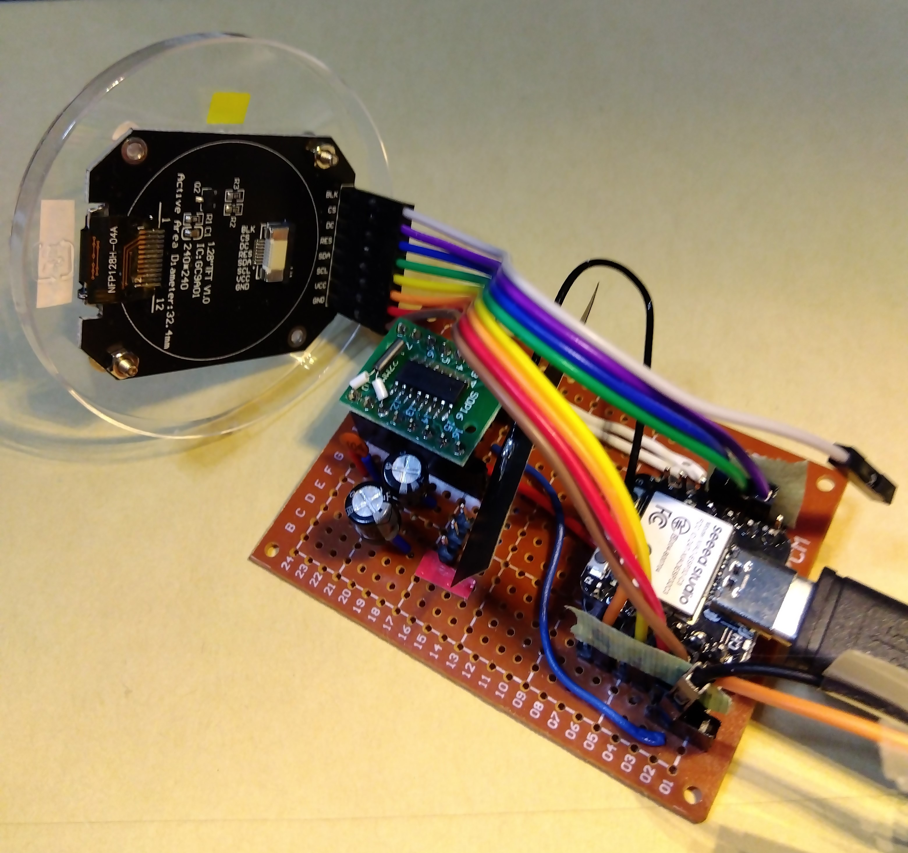
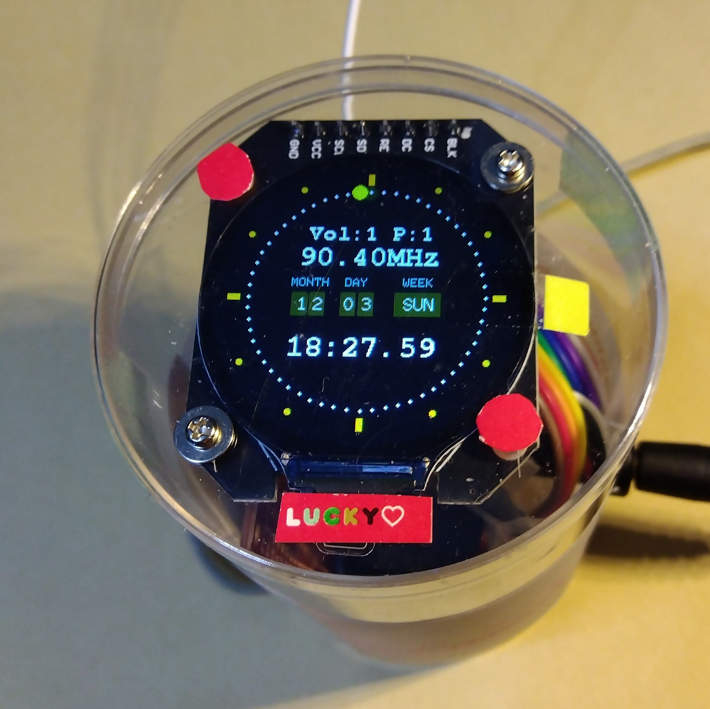

<H3>週間スケジュールが可能なRDA5807 FM DSPラジオ（丸形LCD利用バージョン）</H3>

表示器に丸形カラーLCD利用を使用し、週間スケジュールが可能なFMラジオを製作したので紹介する。 
丸形カラーLCDは、1.28インチ、240x240、ドライバーはCG9A01である。 
DSPラジオICはRDA5807FP、I2Cインターフェースによるコントローラ（MCU）はSeeed Studio XIAO ESP32C3である。 
XIAO ESP32C3では、Clockの設定にNTPを利用し、内蔵のWebサーバー機能で、操作／週間スケジュールの設定を行っている。 
開発はArduino IDE 1.8で行った。 
丸形カラーLCD以外の基本的なことは、<a href="https://github.com/asmnoak/RDA5807_radio_ESP32C3_with_weekly_Schedule">こちら</a>を参照のこと。

<strong>概要</strong> 
丸形カラーLCDは、SPIで制御するので、I2CとSPIを同時に利用することになる。この場合、XIAO ESP32C3は入出力ピンの数が限られるので、 
操作はボタンスイッチではなく、WiFi経由で行なうことになる。 
CG9A01をサポートするライブラリは<a href="https://github.com/Bodmer/TFT_eSPI">"TFT_eSPI.h"</a>を利用した。

TFT_eSPIは事前に、使用するドライバとMCUに対応するための変更が必要である。ライブラリをインストールした後、「..\Arduino\libraries\TFT_eSPI」の「User_Setup.h」を編集する。 
編集後のファイルが「User_Setup.h.mod」である。

<ol>
<li>「Section 1. Call up the right driver file and any options for it」の個所に、ディスプレイ対応のドライバの定義があるので、「#define ILI9341_DRIVER」の行をコメント化し、「#define GC9A01_DRIVER」の行を「非」コメント化する。</li>
<li>「Section 2. Define the pins that are used to interface with the display here」の個所に、各MCUごとSPIに対するピンの定義があるのでそれを変更する。まず、ESP8266のピン定義をコメント化する。 
次に、XIAO_ESP32C3に対するピン定義を追加する。追加内容は、「User_Setup.h.mod」を参照のこと。</li>
</ol>

<strong>H/W構成</strong> 
 ・Seeed Studio XIAO ESP32C3 - コントローラ 
 ・I2C接続&nbsp; RDA5807FP 
 ・SPI接続&nbsp; 丸形カラーLCD表示装置(CG9A01) 
 ・Xtal発振器（32768Hz）、コンデンサ類、オーディオジャック、配線類 

 
左側が丸形カラーLCD、右側がXIAO ESP32CとRDA5807FPの基板。なお、BLK（バックライト制御）は接続していない。

<strong>接続</strong> 
各コンポーネントの接続は以下の通り。 

<table> 
<tr>
<td>I2C&nbsp;</td><td>XIAO</td>
</tr>
<tr>
<td>SCK</td><td>D5</td>
<tr>
<tr>
<td>SDA</td><td>D4</td>
<tr>
</table>

<table> 
<tr>
<td>SPI</td><td>XIAO</td>
</tr>
<tr>
<td>SDA</td><td>GPI10(MOSI)</td>
</tr>
<tr>
<td>SCL</td><td>GPIO8(SCK)</td>
</tr>
<tr>
<td>CS</td><td>GPIO3</td>
</tr>
<tr>
<td>DC</td><td>GPIO5</td>
</tr>
<tr>
<td>RES</td><td>GPIO4</td>
</tr>
</table>

I2Cのアドレス
<table> 
<tr>
<td>RDA5807FP</td><td>0x10&nbsp;or&nbsp;0x11&nbsp;ライブラリで既定</td>
</tr>
</table>

<strong>インストール</strong> 
<ol>
<li>コードを、ZIP形式でダウンロード</li>
<li>追加のライブラリを、ZIP形式でダウンロード、ライブラリマネージャからインストールする</li>
 <ul>
  <li>RDA5807（ライブラリマネージャから検索可）</li>
  <li>TFT_eSPI</li>
  <li>TimeLib&nbsp;:&nbsp; https://github.com/PaulStoffregen/Time</li>
 </ul>
<li>ArduinoIDEからxiao_esp32c3_cg9a01_rda5801_wifi_clock_radio.inoを開く</li>
<li>「検証・コンパイル」に成功したら、一旦、「名前を付けて保存」を行う</li>
</ol>

<strong>若干の解説</strong> 
・コード中のWiFiのSSIDとPASSWORDは、利用している無線ルーターのものを指定する。 
・また、stnFreq[]に受信する放送局の周波数を指定する。例えば80.4MHzの場合、8040と指定する。stnName[]には対応する放送局名を指定する。 
・"Free_Fonts.h"はTFT_eSPIのサンプルよりコピーしたものである。フォントの実体はTFT_eSPIライブラリ内に存在する。 
・外周を回る黄色の丸印は、秒針の替わりである。 

 

<strong>注意事項</strong> 
・利用の際は、自己責任でお楽しみください。 

